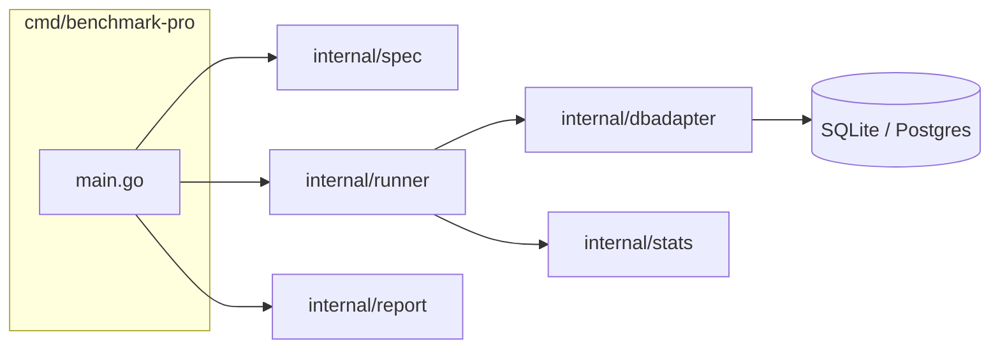

# BenchmarkPro (Go): Design Document (Weeks 1-2)

This mirrors `docs/DESIGN.md` in the Python version — same architecture, same spec format,
same JSON result schema — with the Go-specific implementation decisions below.

## 1. Goal

See the Python version's DESIGN.md §1. The Go port exists so the team can compare a
Go and a Python implementation of the same benchmark runner, or standardise on Go for the
GitHub webhook service in weeks 3-4.

## 2. Package layout

`internal/` keeps these packages unimportable outside the module, matching the Python
version's expectation that only the CLI and, later, the webhook service call into them.

## 3. Dependency choices

The sandbox this was built in only allows outbound access to `github.com` and
`codeload.github.com` for Go — not `proxy.golang.org`, `sum.golang.org` or `gopkg.in`.
`GOPROXY=direct GOSUMDB=off` fetches modules straight from their Git host, so every
dependency had to (a) live on GitHub directly and (b) not pull in a transitive dependency
that doesn't. That ruled out `gopkg.in/yaml.v3` and pure-Go SQLite drivers vendored under
`modernc.org`. Confirm `go build` works the same way on your own network — with normal
proxy access any of those would work too, and there is nothing Go-specific about this
constraint once you're off this sandbox.

| Need | Package | Why this one |
|---|---|---|
| YAML | `github.com/goccy/go-yaml` | Hosted directly on GitHub, no transitive deps off GitHub |
| SQLite | `github.com/mattn/go-sqlite3` | The standard cgo driver; self-contained (bundled C source) |
| Postgres | `github.com/lib/pq` | Pure Go, no cgo, hosted on GitHub |

Both drivers implement `database/sql`, so `internal/dbadapter` is one implementation with an
`engine` switch, rather than two adapter types like the Python version's `SQLiteAdapter` /
`PostgresAdapter`. `%s` in the spec is rewritten per engine: `?` for SQLite, `$1, $2, ...`
for Postgres.

## 4. Measurement method

Same as the Python version: `time.Now()`/`time.Since()` (monotonic in Go) around
execute-and-fetch-all, inside a transaction that is rolled back by default, with 1 warm-up
run discarded before the measured runs. p99 is nearest-rank and equals max at `runs: 10` —
that's correct math, not a bug.

## 5. Result schema

Identical to the Python version's, field for field, except `"python"` becomes `"go_version"`.
This is deliberate: whichever language ends up running in CI, the JSON a baseline comparison
step reads doesn't change.

## 6. Testing

`go vet` is clean and 15 tests cover the same cases as the Python suite: stats math,
spec validation (6 invalid-spec cases), rollback behavior, a broken query not crashing the
run, deterministic seeding (checked via a `SUM(id * user_id)` checksum rather than Python's
full-row equality, since Go's `database/sql` returns typed values that are more work to
compare row-by-row), and a full CLI run asserting on the JSON it writes.

## 7. Known risks

Same as the Python version's §8, plus: the SQLite driver's cgo dependency means the CLI must
be built with a matching C toolchain for each target platform in CI (a plain
`GOOS=... GOARCH=... go build` will not work for cross-compiling SQLite support).

## 8. Out of scope for weeks 1-2

Same as the Python version's §9.
